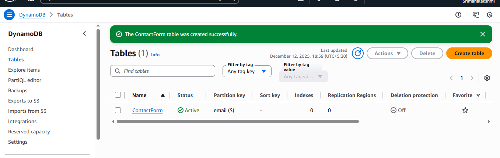
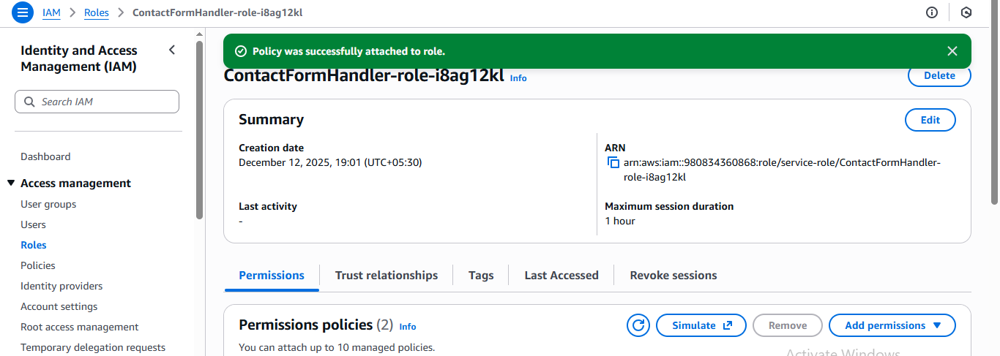
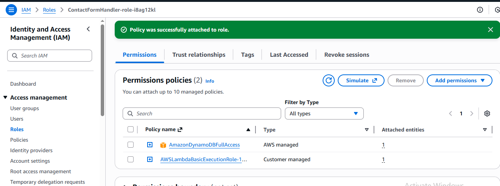
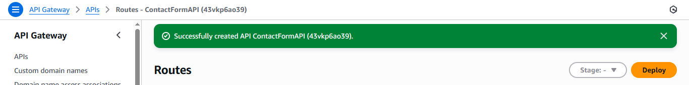
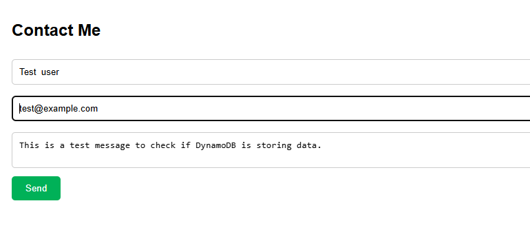

# 📩 Serverless Contact Form Using AWS Lambda

This project implements a fully serverless backend to capture contact form submissions from a website and store them securely in **Amazon DynamoDB**, without the need for managing or provisioning servers.

---

## 🏆 Objective
To build a contact form that:
- Sends data to the backend via **API Gateway**
- Processes the request using **AWS Lambda**
- Stores the form data in **DynamoDB**

A scalable, cost-efficient, and maintenance-free solution using AWS Serverless services.

---

## 🧰 Tech Stack & AWS Services Used

| Component | Technology / Service |
|----------|---------------------|
| Backend Logic | AWS Lambda (Node.js / Python) |
| API Handling | Amazon API Gateway |
| Database | Amazon DynamoDB |
| IAM Roles | Lambda Execution Role + DynamoDB Permissions |
| Frontend UI | HTML Contact Form |
| Monitoring | CloudWatch Logs |

---

## 🏗 Architecture

User Form ➝ API Gateway ➝ Lambda ➝ DynamoDB

📌 API Gateway triggers the Lambda function  
📌 Lambda receives and stores user input into DynamoDB  
📌 Fully serverless — auto-scales with zero maintenance

---

## 📝 DynamoDB Table Configuration

| Setting | Value |
|--------|-------|
| Table Name | ContactForm |
| Partition Key | email (String) |

Additional attributes stored: *name, message, timestamp*

---

## 💡 Features

✔ Serverless, scalable backend  
✔ Secure storage in AWS  
✔ No server provisioning required  
✔ Easy integration into any website  
✔ Pay-only-for-usage billing model  
✔ Logs and debugging via CloudWatch

---

## 🧪 How to Test
1. Open the contact form HTML page in your browser
2. Enter your **name**, **email**, and **message**
3. Click **Send**
4. Verify the submission in your DynamoDB table

---

## 📂 Project Structure

├── index.html # Contact form UI
├── lambda-function.py / index.js # Lambda function handler
├── assets/screenshots/ # AWS setup screenshots
│ ├── n1.png
│ ├── n2.png
│ ├── n3.png
│ ├── n4.png
│ └── n5.png
└── README.md

yaml
Copy code

---

## 📸 Screenshots

| Screenshot | Description |
|-----------|-------------|
|  | Contact Form UI |
|  | DynamoDB Table Created |
|  | IAM Role Permissions for Lambda |
|  | API Gateway Setup |
|  | Form Submission Test |

---

## 🔒 IAM Permissions Required

- `AWSLambdaBasicExecutionRole`
- `AmazonDynamoDBFullAccess` *(least privilege recommended in production)*

---

## 🚀 Future Enhancements

| Feature | Benefit |
|--------|---------|
| Amazon SES Email Notification | Instant email alerts |
| Input Validation | More secure form handling |
| reCAPTCHA | Prevent bot submissions |
| CORS Policy Restrictions | Prevent unauthorized domain usage |
| Data Encryption | Higher data protection |

---

## 🏁 Outcome

A real-world serverless project that demonstrates:
- API creation & integration
- Lambda compute workflows
- NoSQL database operations
- IAM role-based security

Ideal for cloud portfolios and learning serverless architecture.

---

⭐ If you found this helpful, please consider giving the repository a star!
